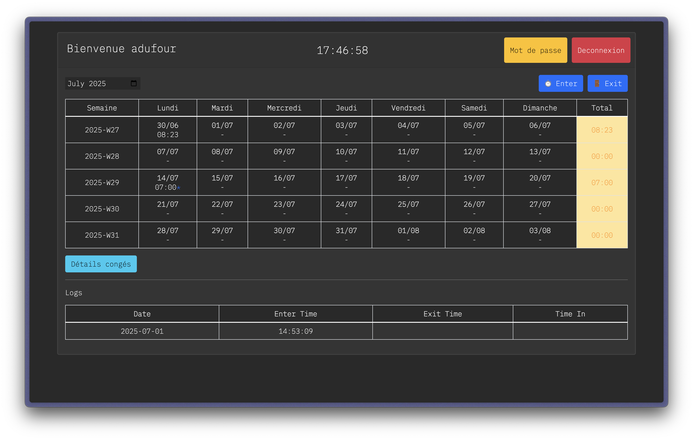
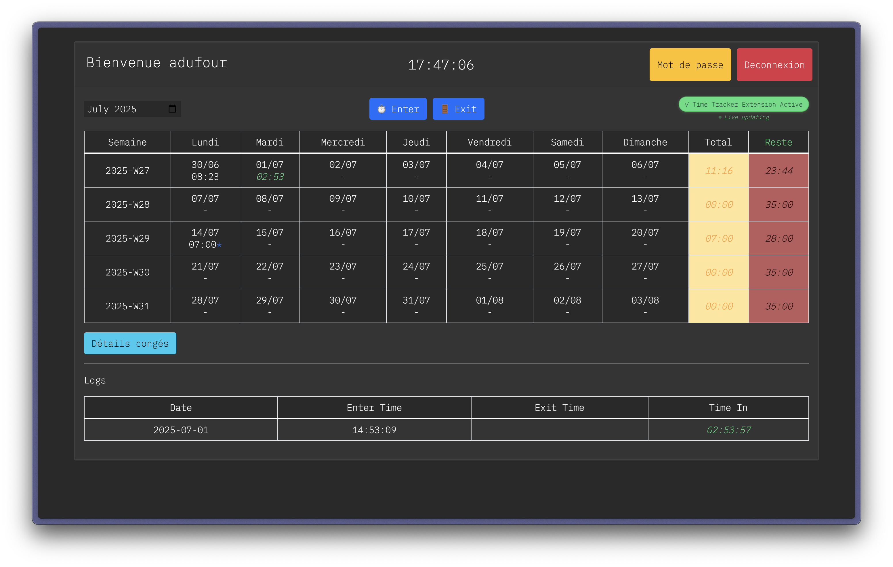

# Zone01 Time Tracker - Extension Chrome

Une extension Chrome qui calcule et met à jour automatiquement vos heures de plateforme sur le système d'émargement Zone01.

## 📸 Aperçu

### Avant l'extension



### Après l'extension



## 🚀 Installation Rapide

### Méthode 1 : Cloner le Dépôt GitHub (Recommandée)

1. **Cloner le Dépôt**

   - Ouvrez un terminal/invite de commande
   - Exécutez la commande suivante :
     ```bash
     git clone https://github.com/Konixy/zone01-time-tracker.git
     ```
   - Cela créera un dossier `zone01-time-tracker` avec tous les fichiers

2. **Installer dans Chrome**

   - Ouvrez Chrome et allez sur `chrome://extensions/`
   - Activez **"Mode développeur"** (coin supérieur droit)
   - Cliquez sur **"Charger l'extension non empaquetée"**
   - Sélectionnez le dossier `zone01-time-tracker` cloné
   - L'extension est maintenant installée !

3. **Mettre à Jour l'Extension**
   - Quand une mise à jour est disponible, ouvrez un terminal dans le dossier de l'extension
   - Exécutez : `git pull`
   - Allez sur `chrome://extensions/`
   - Cliquez sur l'icône de rechargement (🔄) à côté de l'extension Zone01 Time Tracker

### Méthode 2 : Télécharger les Fichiers

- Téléchargez le fichier `zone01-time-tracker.zip`
- Extrayez le contenu dans un dossier sur votre ordinateur
- Suivez les étapes d'installation dans Chrome de la Méthode 1 (étape 2)

### Vérification

- Allez sur `https://hub.zone01normandie.org/emargement/user.php`
- Vous devriez voir un badge vert **"✓ Extension Temps Réel Active"**
- Les valeurs de temps apparaissent en vert et se mettent à jour automatiquement

## ✨ Fonctionnalités

- ⏱️ **Calculs en temps réel** - Met à jour les heures toutes les 10 secondes
- 🟢 **Indicateurs visuels** - Valeurs vertes pour montrer les mises à jour automatiques
- 📊 **Colonnes automatiques** - Heures plateformes, Total heures, et Heures restantes (35h)
- 🔄 **Mise à jour live** - Calcule le temps en cours pour les sessions sans heure de sortie

## 🔧 Problèmes d'Installation ?

Consultez le fichier `INSTALLATION_GUIDE.md` pour un guide détaillé de résolution des problèmes.

---

# Zone01 Time Tracker - Chrome Extension (English)

A Chrome extension that automatically calculates and updates your platform hours in the Zone01 emargement system.

## 📸 Preview

### Before the extension


### After the extension


## 🚀 Quick Installation

### Method 1: Clone GitHub Repository (Recommended)

1. **Clone the Repository**

   - Open a terminal/command prompt
   - Run the following command:
     ```bash
     git clone https://github.com/Konixy/zone01-time-tracker.git
     ```
   - This will create a `zone01-time-tracker` folder with all the files

2. **Install in Chrome**

   - Open Chrome and go to `chrome://extensions/`
   - Enable **"Developer mode"** (top right corner)
   - Click **"Load unpacked"**
   - Select the cloned `zone01-time-tracker` folder
   - The extension is now installed!

3. **Update the Extension**
   - When an update is available, open a terminal in the extension folder
   - Run: `git pull`
   - Go to `chrome://extensions/`
   - Click the reload icon (🔄) next to the Zone01 Time Tracker extension

### Method 2: Download Files

- Download the `zone01-time-tracker.zip` file
- Extract the contents to a folder on your computer
- Follow the Chrome installation steps from Method 1 (step 2)

### Verification

- Go to `https://hub.zone01normandie.org/emargement/user.php`
- You should see a green badge **"✓ Real-time Extension Active"**
- Time values appear in green and update automatically

## ✨ Features

- ⏱️ **Real-time calculations** - Updates hours every 10 seconds
- 🟢 **Visual indicators** - Green values show automatic updates
- 📊 **Automatic columns** - Platform hours, Total hours, and Remaining hours (35h)
- 🔄 **Live updates** - Calculates current time for sessions without exit time

## 🔧 Installation Issues?

Check the `INSTALLATION_GUIDE.md` file for detailed troubleshooting guide.

## Features

- **Automatic Time Calculation**: Calculates total platform hours from the logs table
- **Real-time Updates**: For current day entries without exit time, calculates time from entry to current time
- **Visual Feedback**: Highlights the updated platform hours with a green background
- **Auto-refresh**: Updates calculations every 60 seconds to keep current session time accurate
- **Non-intrusive**: Only runs on the specific Zone01 emargement page

## How it Works

The extension analyzes the logs table and:

1. **For completed entries**: Uses the existing "Time In" value from the table
2. **For current day entries without exit time**: Calculates the difference between entry time and current time
3. **Sums all time values**: Adds up all calculated and existing time values
4. **Updates display**: Replaces the "Heures plateformes" value with the new calculated total

## Installation

### Method 1: Clone GitHub Repository (Recommended)

1. Clone the repository to a local folder:
   ```bash
   git clone https://github.com/Konixy/zone01-time-tracker.git
   ```
2. Open Chrome and navigate to `chrome://extensions/`
3. Enable "Developer mode" in the top right corner
4. Click "Load unpacked" button
5. Select the cloned `zone01-time-tracker` folder
6. The extension should now be loaded and active

**To update:** Run `git pull` in the extension folder, then reload the extension in `chrome://extensions/`

### Method 2: Load as Unpacked Extension (Development)

1. Download or clone this extension files to a local folder
2. Open Chrome and navigate to `chrome://extensions/`
3. Enable "Developer mode" in the top right corner
4. Click "Load unpacked" button
5. Select the folder containing the extension files
6. The extension should now be loaded and active

### Method 3: Pack and Install (Production)

1. In Chrome, go to `chrome://extensions/`
2. Enable "Developer mode"
3. Click "Pack extension"
4. Select the extension folder
5. This creates a `.crx` file that can be distributed
6. Install the `.crx` file by dragging it to the extensions page

## Files Structure

```
zone01-time-tracker/
├── manifest.json          # Extension configuration
├── content.js             # Main logic script
├── README.md             # This file
└── icons/                # Extension icons (optional)
    ├── icon16.png
    ├── icon48.png
    └── icon128.png
```

## Usage

1. Install the extension following the instructions above
2. Navigate to `https://hub.zone01normandie.org/emargement/user.php`
3. The extension will automatically:
   - Analyze your time logs
   - Calculate total platform hours
   - Update the "Heures plateformes" cell with the new value
   - Show a green indicator confirming it's working
4. The calculation updates automatically every 60 seconds

## Technical Details

### Permissions

- `activeTab`: Required to access the Zone01 emargement page content

### Browser Compatibility

- Chrome (Manifest V3)
- Edge (Chromium-based)
- Other Chromium-based browsers

### Security

- Only runs on the specific Zone01 URL: `*://hub.zone01normandie.org/emargement/user.php*`
- No data is sent to external servers
- All calculations are performed locally in the browser

## Troubleshooting

### Extension Not Working

1. Check that you're on the correct URL: `https://hub.zone01normandie.org/emargement/user.php`
2. Open browser console (F12) and look for "Zone01 Time Tracker" messages
3. Ensure the page has fully loaded before expecting calculations
4. Refresh the page if needed

### Incorrect Calculations

1. Verify your system clock is accurate
2. Check that log entries have the expected format (Date, Enter Time, Exit Time, Time In)
3. The extension only calculates current day time for entries without exit times

### Console Debugging

Open the browser console (F12) to see detailed logs:

- Extension loading confirmation
- Processing of each log entry
- Calculation results
- Any error messages

## Development

### Modifying the Extension

1. Edit the relevant files (`content.js` for main logic, `manifest.json` for configuration)
2. Go to `chrome://extensions/`
3. Find the extension and click the reload button
4. Refresh the Zone01 page to test changes

### Key Functions

- `timeToSeconds(timeStr)`: Converts HH:MM:SS to total seconds
- `secondsToTime(totalSeconds)`: Converts seconds back to HH:MM:SS format
- `isToday(dateStr)`: Checks if a date is today
- `updatePlatformHours()`: Main calculation and update function

## License

This extension is provided as-is for educational and productivity purposes. Use responsibly and in accordance with Zone01's terms of service.

## Support

For issues or questions:

1. Check the browser console for error messages
2. Verify you're using a supported browser version
3. Ensure you have the necessary permissions on the Zone01 website
